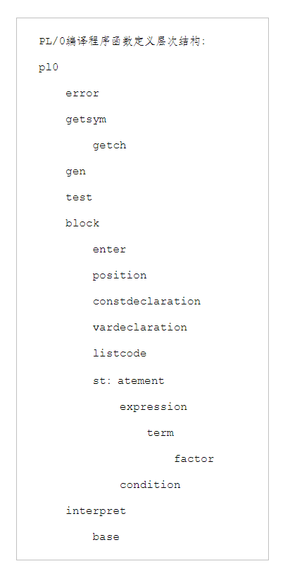
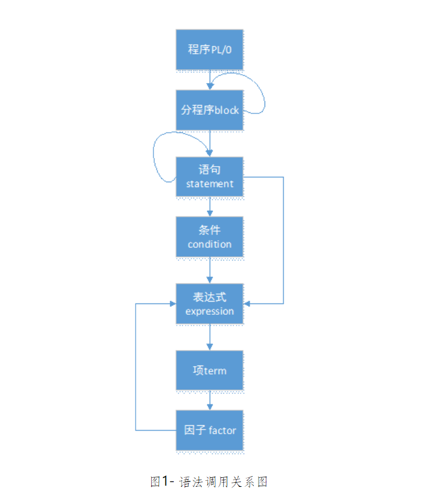

# -PL0
## 实验要求
对PL/0作以下修改扩充：  
（1）增加单词：保留字：FOR，TO，DOWNTO，+=，-=，++，--；RETURN  
        要求：词法识别即可  
（2）替换单词：不等号# 改为 < >  
（3）增加条件语句的ELSE子句  

## 课设要求

（1）扩充赋值运算：+= 和 -=  
（2）扩充语句（Pascal的FOR语句）:  
①FOR <变量>:=<表达式> TO <表达式> DO <语句>  
②FOR <变量>:=<表达式> DOWNTO <表达式> DO <语句>  
     其中，语句①的循环变量的步长为2，语句②的循环变量的步长为-2。  
选做内容（成绩评定范围扩大到：“优”和“良”）  
（1）增加运算：++ 和 --。  
（2）增加类型：① 字符类型;   ② 实数类型。  
（3）扩充函数：① 有返回值和返回语句；② 有参数函数。  
（4）增加一维数组类型（可增加指令）。  

##  设计过程

1、新添加的保留字符号（9个）：

forsym，tosym，downtosym，returnsym，elsesym，（5个关键字）

peql（+=）,meql（-=）, dplus（++）, dminus（--）, 



（来源：[北航 编译实践 PL/0文法 - 姜楠 - 博客园 (cnblogs.com)](https://www.cnblogs.com/ZJUT-jiangnan/p/3494501.html)）

| 单词符号  | 类型                                  |
| --------- | ------------------------------------- |
| +         | plus                                  |
| -         | minus                                 |
| *         | times                                 |
| /         | slash                                 |
| (         | lparen                                |
| )         | rparen                                |
| =         | eql                                   |
| ,         | comma                                 |
| .         | period                                |
| **#**     | **neq** **（在本次实验中修改成 <>）** |
| ;         | semicolon                             |
| begin     | beginsym                              |
| call      | callsym                               |
| const     | constsym                              |
| do        | dosym                                 |
| end       | endsym                                |
| if        | ifsym                                 |
| odd       | oddsym                                |
| procedure | proceduresym                          |
| read      | readsym                               |
| then      | thensym                               |
| var       | varsym                                |
| while     | whilesym                              |
| ...       | ...                                   |

| 新添加单词符号 | 类型          |
| -------------- | ------------- |
| **for**        | **forsym**    |
| **to**         | **tosym**     |
| **downto**     | **downtosym** |
| **return**     | **returnsym** |
| **else**       | **elsesym**   |
| **+=**         | **peql**      |
| **-=**         | **meql**      |
| **++**         | **dplus**     |
| **--**         | **dminus**    |

（黑体单词符号是本次实验中添加内容）

语法分析：




代码保存驿站：

```c
VAR a,c;
begin
 read(a);
 c:=a++;
 write(c)
 c:=a--;
 write(c)

 c:=++a;
 write(c)
 c:=--a;
 write(c)

 a+:=1;
 c:=a;
 write(c)

 a-:=1;
 c:=a;
 write(c)

end.
```

```
int statement(bool* fsys, int* ptx, int lev)
{
	int i, cx1, cx2;
	bool nxtlev[symnum];
	if (sym == ident) /*准备按照赋值语句处理*/
	{
		i = position(id, *ptx);
		if (i == 0)
		{
			error(11); /*变量未找到*/
		}
		else
		{
			/*
			*科宪
			*/
			if (table[i].kind != variable)
			{
				error(12); /*赋值语句格式错误*/
				i = 0;
			}
			else
			{
				getsymdo;
				if (sym == becomes)
				{
					getsymdo;
					/*-------add_up-------*/
					memcpy(nxtlev, fsys, sizeof(bool) * symnum);
					expressiondo(nxtlev, ptx, lev);
					if (i != 0) {		/* i应该指向当前语句左部标识符在符号表中的位置 */
						gendo(sto, lev - table[i].level, table[i].adr);
					}
					/*-----------add_bottom------------*/
				}
				/*---------------add_up----------------*/
				else if (sym = peql) {			/*处理+=语句*/
					i = position(id, *ptx);
					gendo(lod, lev - table[i].level, table[i].adr);
					getsymdo;
					if (sym == semicolon) {
						getsymdo;
					}
					memcpy(nxtlev, fsys, sizeof(bool) * symnum);
					expressiondo(nxtlev, ptx, lev);
					gendo(opr, 0, 2);
					if (i != 0) {
						gendo(sto, lev - table[i].level, table[i].adr);
					}
				}
				else if (sym == meql) {			/*处理-=语句*/
					i = position(id, *ptx);
					gendo(lod, lev - table[i].level, table[i].adr);
					getsymdo;
					if (sym == semicolon) {
						getsymdo;
					}
					memcpy(nxtlev, fsys, sizeof(bool) * symnum);
					expressiondo(nxtlev, ptx, lev);
					gendo(opr, 0, 3);
					if (i != 0) {
						gendo(sto, lev - table[i].level, table[i].adr);
					}
				}
				//else if (sym = dplus) {			/*后++运算*/
				//	getsymdo;
				//	gendo(lod, lev - table[i].level, table[i].adr);	 //找到变量地址，将其值入栈
				//	gendo(lit, 0, 1);	//取常数1到栈顶
				//	if (i != 0) {
				//		gendo(opr, 0, 2);		//次栈顶与栈顶的值相加，结果存入次栈顶，t减1
				//		gendo(sto, lev - table[i].level, table[i].adr);
				//	}
				//}
				//else if (sym = dminus) {
				//	getsymdo;
				//	gendo(lod, lev - table[i].level, table[i].adr);	 //找到变量地址，将其值入栈
				//	gendo(lit, 0, 1);	//取常数1到栈顶
				//	if (i != 0) {
				//		gendo(opr, 0, 3);		//次栈顶与栈顶的值相减，结果存入次栈顶，t减1
				//		gendo(sto, lev - table[i].level, table[i].adr);
				//	}
				//}
				///*--------------add_bottom--------------*/
				else
				{
					error(13); /*没有检测到赋值符号 */
				}
				//memcpy(nxtlev, fsys, sizeof(bool) * symnum);
				//expressiondo(nxtlev, ptx, lev); /*处理赋值符号右侧表达式*/
				//if (i != 0)
				//{
				//	/*expression将执行一系列指令，但最终结果将会保存在栈顶，执行 sto命令完成赋值 */
				//	gendo(sto, lev - table[i].level, table[i].adr);
				//}
			}
		}//if(i == 0)
	}
	/*-------------------add_up---------------------------*/
	else if (sym = dplus) {		/*前++运算*/
		getsymdo;		//因为是前++，所以后面要跟变量variable
		if (sym == ident) {
			i = position(id, *ptx);		//ident在符号表中的位置
			if (i == 0)	error(11);
			else {
				if (table[i].kind != variable) {
					error(12);
					i = 0;
				}
				else {
					getsymdo;
					gendo(lod, lev - table[i].level, table[i].adr);
					gendo(lit, 0, 1);
					if (i != 0) {
						gendo(opr, 0, 2);
						gendo(sto, lev - table[i].level, table[i].adr);
					}
				}
			}
		}
		else {
			error(19);
		}
	}
	else if (sym == dminus) {	/*前--运算*/
		getsymdo;
		if (sym == ident)
		{
			i = position(id, *ptx);
			if (i == 0) error(11);
			else
			{
				if (table[i].kind != variable)
				{
					error(12);
					i = 0;
				}
				else  
				{
					getsymdo;
					gendo(lod, lev - table[i].level, table[i].adr);
					gendo(lit, 0, 1);
					if (i != 0)
					{
						gendo(opr, 0, 3); 
						gendo(sto, lev - table[i].level, table[i].adr);
					}
				}

			}
		}
		else
		{
			error(19);
		}
	}
	/*-----------------add_bottom-------------------------*/
	else
	{
		if (sym == readsym) /*准备按照 read语句处理*/
		{
			getsymdo;
			if (sym != lparen)
			{
				error(34); /*格式错误，应是左括号 */
			}
			else
			{
				do
				{
					getsymdo;
					if (sym == ident)
					{
						i = position(id, *ptx); /*查找要读的变量 */
					}
					else
					{
						i = 0;
					}
					if (i == 0)
					{
						error(35); /*read() 中应是声明过的变量名 */
					}
					/*
						* 孔止
						* begin
					*/

					else
					{
						gendo(opr, 0, 16);  //生成输入指令，读取值到栈顶
						gendo(sto, lev - table[i].level, table[i].adr);  //储存到变量
					}
					getsymdo;
				} while (sym == comma);  //一条read语句可读多个变量
			}
			if (sym != rparen)
			{
				error(33);                  //格式错误，应是右括号
				while (!inset(sym, fsys))    //出错补救，直到收到上层函数的后跟符号
				{
					getsymdo;
				}
			}
			else
			{
				getsymdo;
			}
		}
		else
		{
			if (sym == writesym)   //准备按照write语句处理，与read类似
			{
				getsymdo;
				if (sym == lparen)
				{
					do {
						getsymdo;
						memcpy(nxtlev, fsys, sizeof(bool) * symnum);
						nxtlev[rparen] = true;
						nxtlev[comma] = true;  //write的后跟符号为 ) or ,
						expressiondo(nxtlev, ptx, lev);   /*
															* 调用表达式处理，此处与read不同，
															* read为给变量赋值
															*/
						gendo(opr, 0, 14);     //生成输出指令，输出栈顶的值
					} while (sym == comma);
					if (sym != rparen)
					{
						error(33);    //write()中应为完整表达式
					}
					else
					{
						getsymdo;
					}
				}
				gendo(opr, 0, 15);      //输出换行
			}
			else
			{
				if (sym == callsym)      //准备按照call语句处理
				{
					getsymdo;
					if (sym != ident)
					{
						error(14);      //call后应为标识符
					}
					else
					{
						i = position(id, *ptx);
						if (i == 0)
						{
							error(11);  //过程未找到
						}
						else
						{
							if (table[i].kind == procedur)
							{
								gendo(cal, lev - table[i].level, table[i].adr);
							}
							else
							{
								error(15);
							}
						}
						getsymdo;
					}
				}
				/*
				* end
				*/

				/*
				* 卢柏铖
				* begin
				*/
				else
				{
					if (sym == ifsym)
					{
						getsymdo;
						memcpy(nxtlev, fsys, sizeof(bool) * symnum);
						nxtlev[thensym] = true;
						nxtlev[dosym] = true;
						/*-------add_up-------*/
						nxtlev[elsesym] = true;//添加后跟符号else
						/*-------add_bottom------*/
						conditiondo(nxtlev, ptx, lev);
						if (sym == thensym)
						{
							getsymdo;
						}
						else
						{
							error(16);
						}
						cx1 = cx;
						gendo(jpc, 0, 0);
						statementdo(fsys, ptx, lev);
						code[cx1].a = cx;

						/*-------add_up---------*/
						if (sym != elsesym) { code[cx1].a = cx; }
						else
						{
							getsymdo;
							cx2 = cx;
							code[cx1].a = cx + 1;
							gendo(jmp, 0, 0);
							statementdo(fsys, ptx, lev);
							code[cx2].a = cx;
						}
						/*------add_bottom--------*/

					}
					else
					{
						/*
						* end
						*/

						/*
						* 李兆海
						*/
						if (sym == beginsym)		/*准备按照复合语句处理*/
						{
							getsymdo;
							memcpy(nxtlev, fsys, sizeof(bool) * symnum);
							nxtlev[semicolon] = true;
							nxtlev[endsym] = true;		/*后跟符号为分号或end*/
														/*循环调用语句处理函数，直到下一个符号不是语句开始符号或收到end*/
							statementdo(nxtlev, ptx, lev);
							while (inset(sym, statbegsys) || sym == semicolon)
							{
								if (sym == semicolon)
								{
									getsymdo;
								}
								else
								{
									error(10);		/*缺少分号*/
								}
								statementdo(nxtlev, ptx, lev);
							}
							if (sym == endsym)
							{
								getsymdo;
							}
							else
							{
								error(17);		/*缺少end或分号*/
							}
						}
						/*
						* end
						*/

						/*
						* 刘芊羿
						* begin
						*/

						else
						{
							if (sym == whilesym)
							{
								cx1 = cx;
								getsymdo;
								memcpy(nxtlev, fsys, sizeof(bool) * symnum);
								nxtlev[dosym] = true;
								conditiondo(nxtlev, ptx, lev);
								cx2 = cx;
								gendo(jpc, 0, 0);
								if (sym == dosym)
								{
									getsymdo;
								}
								else {
									error(18);
								}
								statementdo(fsys, ptx, lev);
								gendo(jmp, 0, cx1);
								/*
									* end
									*/
									//3118005419彭凯金 P388

								code[cx2].a = cx;  /* 反填跳出循环的地址，与if类似 */
							}
							else
							{
								memset(nxtlev, 0, sizeof(bool) * symnum); /* 语句结束无补救集合*/

								testdo(fsys, nxtlev, 19); /* 检测语句结束的正确性 */

							}
						}
					}

				}
			}
		}
	}
	return 0;
}
```


```c
int statement(bool* fsys, int* ptx, int lev)
{
	int i, cx1, cx2;
	bool nxtlev[symnum];
	if (sym == ident) /*准备按照赋值语句处理*/
	{
		i = position(id, *ptx);
		if (i == 0)
		{
			error(11); /*变量未找到*/
		}
		else
		{
			/*
			*科宪
			*/
			if (table[i].kind != variable)
			{
				error(12); /*赋值语句格式错误*/
				i = 0;
			}
			else
			{
				getsymdo;
				if (sym == becomes)
				{
					getsymdo;
					/*-------------add_up----------------*/
					memcpy(nxtlev, fsys, sizeof(bool) * symnum);
					expressiondo(nxtlev, ptx, lev);
					if (i != 0)//如果不曾出错，i将不为0，i所指为当前语句
							//左部标识符在符号表中的位置 
					{
						gendo(sto, lev - table[i].level, table[i].adr);
					}
					/*--------------add_bottom-----------*/
				}
				/*--------------------add_up----------------*/
				else if (sym == peql) // 检测到 +＝符号
				{
					i = position(id, *ptx); 
					gendo(lod, lev - table[i].level, table[i].adr);      /* 找到变量地址并将其值入栈 */
					getsymdo;
					if (sym == semicolon)
					{
						getsymdo;
					}
					memcpy(nxtlev, fsys, sizeof(bool) * symnum);
					expressiondo(nxtlev, ptx, lev);
					gendo(opr, 0, 2);
					if (i != 0)
					{
						gendo(sto, lev - table[i].level, table[i].adr);
					}
				}
				else if (sym == meql) // 检测到 - ＝符号
				{
					i = position(id, *ptx);
					gendo(lod, lev - table[i].level, table[i].adr);      /* 找到变量地址并将其值入栈 */
					getsymdo;
					if (sym == semicolon)
					{
						getsymdo;
					}
					memcpy(nxtlev, fsys, sizeof(bool) * symnum);
					expressiondo(nxtlev, ptx, lev);
					gendo(opr, 0, 3);
					if (i != 0)
					{
						gendo(sto, lev - table[i].level, table[i].adr);
					}
				}
				/*-----------------------add_bottom--------------*/
			}
		}//if(i == 0)
	}
	else
	{
		if (sym == readsym) /*准备按照 read语句处理*/
		{
			getsymdo;
			if (sym != lparen)
			{
				error(34); /*格式错误，应是左括号 */
			}
			else
			{
				do
				{
					getsymdo;
					if (sym == ident)
					{
						i = position(id, *ptx); /*查找要读的变量 */
					}
					else
					{
						i = 0;
					}
					if (i == 0)
					{
						error(35); /*read() 中应是声明过的变量名 */
					}
					/*
						* 孔止
						* begin
					*/

					else
					{
						gendo(opr, 0, 16);  //生成输入指令，读取值到栈顶
						gendo(sto, lev - table[i].level, table[i].adr);  //储存到变量
					}
					getsymdo;
				} while (sym == comma);  //一条read语句可读多个变量
			}
			if (sym != rparen)
			{
				error(33);                  //格式错误，应是右括号
				while (!inset(sym, fsys))    //出错补救，直到收到上层函数的后跟符号
				{
					getsymdo;
				}
			}
			else
			{
				getsymdo;
			}
		}
		else
		{
			if (sym == writesym)   //准备按照write语句处理，与read类似
			{
				getsymdo;
				if (sym == lparen)
				{
					do {
						getsymdo;
						memcpy(nxtlev, fsys, sizeof(bool) * symnum);
						nxtlev[rparen] = true;
						nxtlev[comma] = true;  //write的后跟符号为 ) or ,
						expressiondo(nxtlev, ptx, lev);   /*
															* 调用表达式处理，此处与read不同，
															* read为给变量赋值
															*/
						gendo(opr, 0, 14);     //生成输出指令，输出栈顶的值
					} while (sym == comma);
					if (sym != rparen)
					{
						error(33);    //write()中应为完整表达式
					}
					else
					{
						getsymdo;
					}
				}
				gendo(opr, 0, 15);      //输出换行
			}
			else
			{
				if (sym == callsym)      //准备按照call语句处理
				{
					getsymdo;
					if (sym != ident)
					{
						error(14);      //call后应为标识符
					}
					else
					{
						i = position(id, *ptx);
						if (i == 0)
						{
							error(11);  //过程未找到
						}
						else
						{
							if (table[i].kind == procedur)
							{
								gendo(cal, lev - table[i].level, table[i].adr);
							}
							else
							{
								error(15);
							}
						}
						getsymdo;
					}
				}
				/*
				* end
				*/

				/*
				* 卢柏铖
				* begin
				*/
				else
				{
					if (sym == ifsym)
					{
						getsymdo;
						memcpy(nxtlev, fsys, sizeof(bool) * symnum);
						nxtlev[thensym] = true;
						nxtlev[dosym] = true;
						conditiondo(nxtlev, ptx, lev);
						if (sym == thensym)
						{
							getsymdo;
						}
						else
						{
							error(16);
						}
						cx1 = cx;
						gendo(jpc, 0, 0);
						statementdo(fsys, ptx, lev);
						code[cx1].a = cx;


					}
					else
					{
						/*
						* end
						*/

						/*
						* 李兆海
						*/
						if (sym == beginsym)		/*准备按照复合语句处理*/
						{
							getsymdo;
							memcpy(nxtlev, fsys, sizeof(bool) * symnum);
							nxtlev[semicolon] = true;
							nxtlev[endsym] = true;		/*后跟符号为分号或end*/
														/*循环调用语句处理函数，直到下一个符号不是语句开始符号或收到end*/
							statementdo(nxtlev, ptx, lev);
							while (inset(sym, statbegsys) || sym == semicolon)
							{
								if (sym == semicolon)
								{
									getsymdo;
								}
								else
								{
									error(10);		/*缺少分号*/
								}
								statementdo(nxtlev, ptx, lev);
							}
							if (sym == endsym)
							{
								getsymdo;
							}
							else
							{
								error(17);		/*缺少end或分号*/
							}
						}
						/*
						* end
						*/

						/*
						* 刘芊羿
						* begin
						*/

						else
						{
							if (sym == whilesym)
							{
								cx1 = cx;
								getsymdo;
								memcpy(nxtlev, fsys, sizeof(bool) * symnum);
								nxtlev[dosym] = true;
								conditiondo(nxtlev, ptx, lev);
								cx2 = cx;
								gendo(jpc, 0, 0);
								if (sym == dosym)
								{
									getsymdo;
								}
								else {
									error(18);
								}
								statementdo(fsys, ptx, lev);
								gendo(jmp, 0, cx1);
								/*
									* end
									*/
									//3118005419彭凯金 P388

								code[cx2].a = cx;  /* 反填跳出循环的地址，与if类似 */
							}
							else
							{
								memset(nxtlev, 0, sizeof(bool) * symnum); /* 语句结束无补救集合*/

								testdo(fsys, nxtlev, 19); /* 检测语句结束的正确性 */

							}
						}
					}

				}
			}
		}
	}
	return 0;
}
```


参考博客：

【1】[(1条消息) 编译原理大作业-PL0语言编译器_dark的博客-CSDN博客_编译原理大作业](https://blog.csdn.net/weixin_43323146/article/details/113792219)

【2】扩展ELSE[(1条消息) Pl0编译器扩充_尘心(●—●)的博客-CSDN博客](https://blog.csdn.net/qq_41979507/article/details/103934856)

【3】我已经笑了[(1条消息) 编译原理课程设计-PL/0编译器的扩充（C语言完整版）_Cheung-CSDN博客](https://blog.csdn.net/Ahoob/article/details/44519687)

